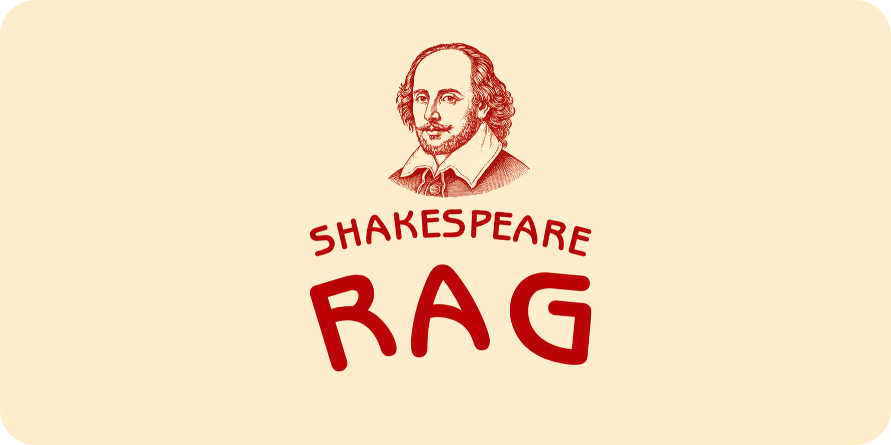
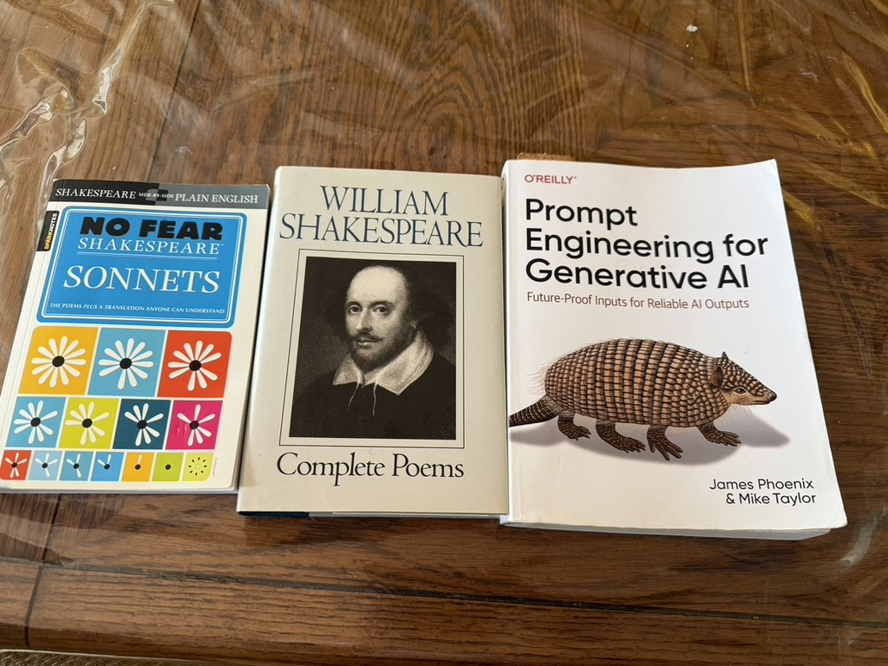
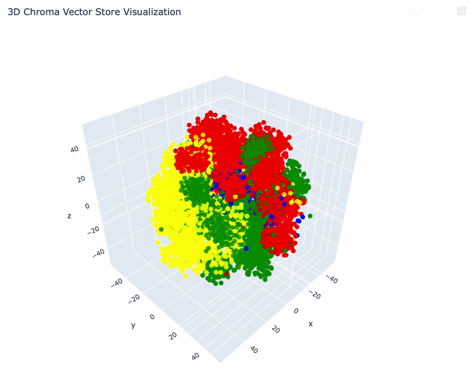
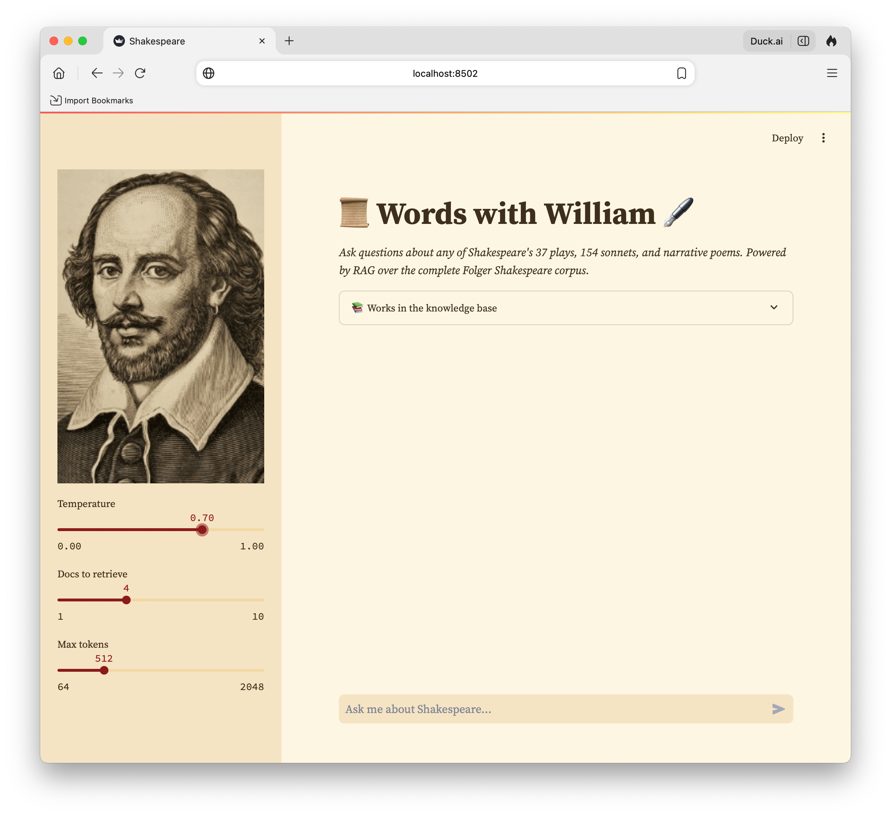

<h1 align="center">

</h1> 

# ShakespeareLLM — A Retrieval-Augmented Generation System for Shakespeare's Complete Works



A production RAG system built over Shakespeare's complete corpus — 35 plays, 154 sonnets, 
and narrative poems from the Folger Shakespeare Library. Ask questions, explore themes, 
and retrieve grounded answers directly from the text.

## The Vector Space

One of the more interesting findings when building this: when you embed Shakespeare's works 
and reduce them to three dimensions with t-SNE, the genres cluster naturally. Comedies 
group together. Tragedies group together. Histories and poetry form their own regions. 
The model learned genre without being told genre. It's purely a function of how 
Shakespeare wrote differently across forms.



## The System



Built with:
- **LangChain** for document loading, chunking, and retrieval chain orchestration
- **Chroma** as the vector database with persistent local storage
- **HuggingFace sentence-transformers** (`all-MiniLM-L6-v2`) for embeddings:  
  384-dimensional vectors, runs locally with no API cost
- **Claude Haiku** (Anthropic) as the LLM backend
- **Streamlit** for the production UI with adjustable temperature, retrieval k, 
  and max token controls

## The Corpus

35 PDFs sourced from the [Folger Shakespeare Library](https://www.folger.edu/explore/shakespeares-works/download/) — 
the most authoritative modern editions of Shakespeare's works.

**Tragedies:** Hamlet, Macbeth, Othello, King Lear, Romeo & Juliet, Antony and Cleopatra, 
Coriolanus, Julius Caesar, Timon of Athens, Titus Andronicus, Troilus and Cressida

**Comedies:** A Midsummer Night's Dream, Much Ado About Nothing, Twelfth Night, 
The Tempest, The Winter's Tale, As You Like It, The Taming of the Shrew, 
Measure for Measure, The Merry Wives of Windsor, The Comedy of Errors, 
Love's Labour's Lost, The Two Gentlemen of Verona, All's Well That Ends Well, 
Pericles, Cymbeline, The Two Noble Kinsmen

**Histories:** Henry IV Part 1 & 2, Henry V, Henry VI Parts 1-3, Henry VIII, 
Richard II, Richard III, King John

**Poetry:** Sonnets, Venus and Adonis, Lucrece, The Phoenix and the Turtle

## Pipeline

35 Folger PDFs

→ PyPDFLoader (LangChain)

→ CharacterTextSplitter (chunk_size=1000, overlap=250)

→ Genre metadata tagging (comedy/tragedy/history/poetry)

→ HuggingFace embeddings (all-MiniLM-L6-v2)

→ Chroma vectorstore (4,576 chunks, 384 dimensions)

→ ConversationalRetrievalChain

→ Claude Haiku

→ Streamlit UI

## Setup

**Clone and install:**
```bash
git clone https://github.com/Dre1896/ShakespeareLLM.git
cd ShakespeareLLM
pip install -r requirements.txt
```

**Add your API key:**
```bash
cp .env.example .env
# Add your ANTHROPIC_API_KEY to .env
```

**Download the corpus:**

Get the PDFs from the [Folger Shakespeare Library](https://www.folger.edu/explore/shakespeares-works/download/) 
and place them in a `data/` folder.

**Build the vectorstore (first time only — takes ~5 minutes):**
```bash
python3 shk_llm.py
```

**Run the app:**
```bash
streamlit run shakespeare_streamlit_bot.py
```

## What's Next

This is an actively evolving project. Planned additions:

- **Lexical analysis page** — word frequency, vocabulary richness, archaic language 
  distribution across plays
- **Thematic similarity page** — cosine similarity between plays based on their 
  vector representations. Which tragedy is most similar to which history?
- **Hybrid retrieval** — BM25 + semantic search via EnsembleRetriever for better 
  handling of character names and exact quotes
- **QA evaluation pipeline** — graded accuracy scores across a curated 
  question-answer set
- **Extended corpus** — Holinshed's Chronicles, Plutarch's Lives, Elizabethan 
  criticism to enable source comparison queries
- **Multi-page Streamlit app** with landing page and ambient period music

## Environment

Python 3.11 · LangChain 0.3.x · Anthropic Claude Haiku · 
HuggingFace sentence-transformers · Chroma · Streamlit

## Data Source

[Folger Shakespeare Library](https://www.folger.edu/explore/shakespeares-works/download/) — 
open access editions of Shakespeare's complete works.
